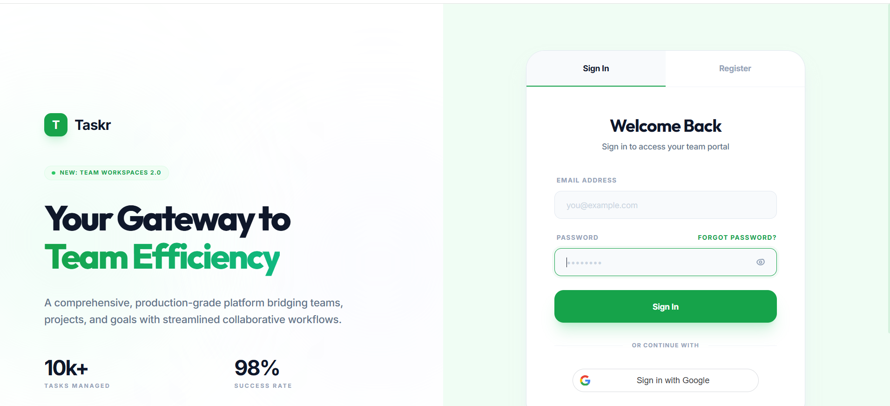

# 🚀 Taskr - Team Task Management System

**Taskr** is a production-ready, full-stack collaborative platform designed for teams to manage projects, assign tasks, and track performance in real-time.

## ✨ Key Features

- 🔐 **Secure Authentication:** Full JWT-based system with a secure **Password Reset** flow.
- 👥 **Role-Based Access Control (RBAC):** Dashboards for **Admins** and **Members**.
- 📊 **Advanced Analytics:** Real-time tracking of tasks, projects, and team productivity.
- 📂 **Project Management:** Create projects and assign multiple team members.
- 🌿 **Premium UI/UX:** Modern Green & White professional theme.

## 🛠️ Tech Stack

- **Frontend:** React.js, Vite
- **Backend:** Node.js, Express.js
- **Database:** SQLite (via Prisma ORM)

## 🚀 Installation

1. Install dependencies: `npm run install-all`
2. Sync Database: `cd backend && npx prisma db push`
3. Run App: `npm run dev`
